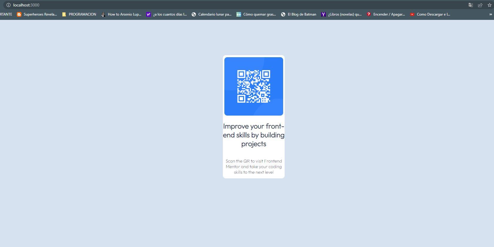

# Frontend Mentor - QR code component solution

This is my solution to the [QR code component challenge on Frontend Mentor](https://www.frontendmentor.io/challenges/qr-code-component-iux_sIO_H). Frontend Mentor challenges help you improve your coding skills by building realistic projects. 

## Table of contents

- [Overview](#overview)
  - [Screenshot](#screenshot)
  - [Links](#links)
- [My process](#my-process)
  - [Built with](#built-with)
  - [Continued development](#continued-development)
- [Author](#author)

## Overview
### Screenshot

### Links

- Solution URL: [Solution on Github](https://github.com/ricardosuab93/QR-COMPONENT-FM)
- Live Site URL: [Live site on Netlify](https://glittery-challengefm.netlify.app/)

## My process

### Built with

- CSS custom properties
- Flexbox
- Mobile-first workflow
- [React](https://reactjs.org/) - JS library

### Continued development

**Mental Note: Definitily I'm going to get better with my css skills.**

## Author
<!-- - Website - [Add your name here](https://www.your-site.com) -->
- Frontend Mentor - [@ricardosuab93](https://www.frontendmentor.io/profile/ricardosuab93)
- Twitter - [@richiesuarez](https://twitter.com/richiesuarez)

